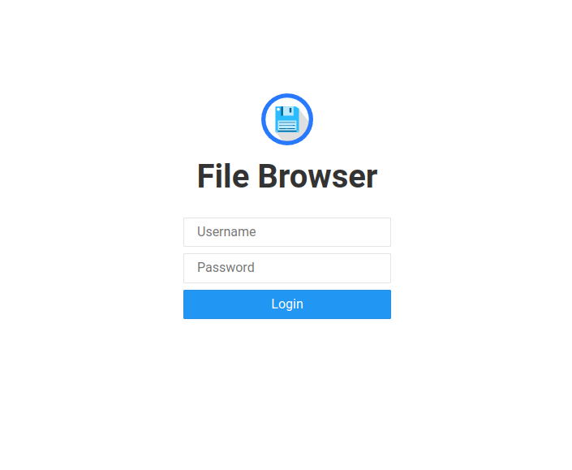

# File Browser

Based on the open source project [filebrowser](https://github.com/filebrowser/filebrowser), this docker-compose file allows you to quickly bootstrap a web UI for downloading files. The web interface is protected by a username and password that you define when starting the container.

## Install docker

This project is just a docker-compose file, so you need to have docker installed and running to use it. If you don't, you can get it [here](https://github.com/sultanofcardio/scripts/tree/master/bash/install-docker)

## Testing locally

Run the following commands, replacing the values in angle brackets

```shell
cat << EOF > .env
username=<username>
password=<password>
hostname=<server-hostname>
LETSENCRYPT_EMAIL=<email-address>
EOF

touch ./filebrowser.db
mkdir -p files

docker-compose -f docker-compose.local.yaml up -d
```

Then browse to http://localhost:8080 and login using the credentials you configured



Add files to the `files` directory or create them in the web interface

## Running remotely

If you have a VPS with a domain name (`server-hostname` below) pointing to it, and you want to expose the web UI to the internet, just remove `-f docker-compose.local.yaml` from the last command

```shell
cat << EOF > .env
username=<username>
password=<password>
hostname=<server-hostname>
LETSENCRYPT_EMAIL=<email-address>
EOF

touch ./filebrowser.db
mkdir -p files

docker-compose up -d
```

Then you'll be able to access the web interface at https://<server-hostname>
